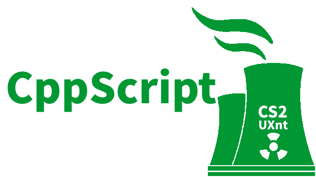

# cpp-script

[](https://github.com/uxnt/cpp-script)

---
## Cpp Script - 你好中文
```javascript
导入 控制台;
函数 main() {
	打印("你好中文");
}
```
打印输出：

```
你好中文
```

---
## Cpp Script - 你好世界
```javascript
// import console
import console;
function main() {
	var x = 2021;
	printf("Hello, World" + " - " + x);
}
```
打印输出：

```
Hello, World - 2021
```
----
## Cpp Script - 算法
```javascript
// import console
import console;
function main() {
	printf(1+1);
}
```
打印输出：

```
2
```
---
## Cpp Script - 判断
```javascript
// import console
import console;
function main() {
    var x = 6;
	if(x > 5) {
		printf("Well done!");
	}
}
```
打印输出：
```
Well done!
```
---

## Cpp Script - 关键字

|关键字|
|-|
|import|
|var|
|function|
|if|
|else|
|elsif|
|while|
|for|
|return|
|true|
|false|
|null|
||
|boolean|
|byte|
|class|
|int|
|const|
|long|
|float|
|double|
|char|
|void|
|string|


